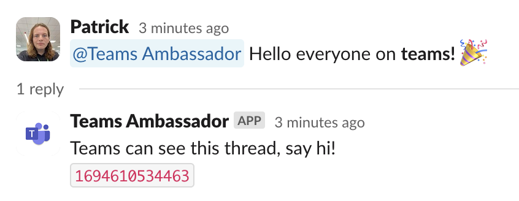
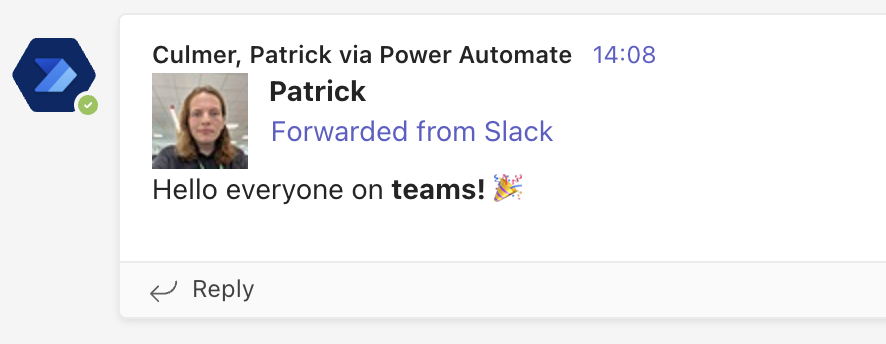
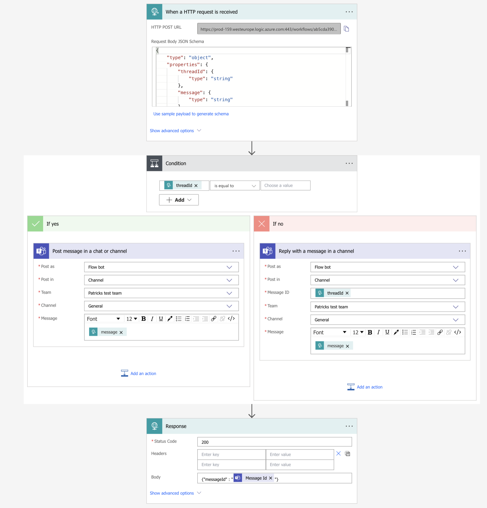

# Slack Ambassador

This is a bot to keep MS Teams users up to date what is going on in Slack channels.
All code is written in python. It uses Bolt API for slack and HTTP requests to power automate flow for Teams.

Currently only Messages from Slack to Teams is implemented however it would possible to implement two way communication.

## Use
The Bot is a activated by @mentioning the bot in a slack message. The bot will respond with a message confirming it has been activated and saving the ID of the teams message. From then on all new messages in the thread will also be posted on Teams.
|||
|---|---|
## Formatting Messages

Slack messages are formatted using a proprietary form of markdown. Teams messages support standard markdown and a subset of HTML (not CSS).

Emoticons are converted using the emoji-data-python module. The module does not appear to be actively maintained and is only compatible with unicode 13. I am using a fork of the module updated to unicode 15 found [here](https://github.com/VeryCoolPatrick/emoji-data-python).

The slackdown module is used to convert most of the markdown to HTML. Unfortunately the repo has been archived for a number of years and there are no viable alternative that can parse Slack flavour markdown. It is functional for the most standard messages but can break with complicated combinations of links and formatting.


```
<@U05LD4RV98X> <@U05N29QP3JS> Check out this <http://google.com|link> :grin:
```
```HTML
<p><b>Jovi</b> Check out this <a href="http://google.com" target="blank">link</a> \U0001f601</p>
```
><p><b>Jovi</b> Check out this <a href="http://google.com" target="blank">link</a> 😁</p>

## Images

Images uploaded to slack have a number of URLs associated with them to download and view them at various sizes. Unfortunately external services like Teams do not have access to these URLs by default. Files can be made public through the API but this may lead to a security issue.
To get around this there is an alternate method to attach images. A small thumbnail of the image is downloaded and converted to a Base64 format. The image can then be appended to the end of the message in an HTML hyperlink.


## Slack Bot

A bot will need to be added to the slack channel you want to use.
The bot will need to be subscribed to these events:
- app_mention
  - To trigger trigger the bot on a @mention
- message.channels
  - Triggers on all messages but importantly replies

And need these permissions:
- channels:history
- app_mentions:read
- channels:read
- chat:write
- users:read
- files:read
- files:write
  - This last permission is unlikely to be granted but there is a workaround

## Power Automate Flow


To get around registering an app with azure, this bot uses MS flows to handle all HTTP requests on teams end.
The flow accepts a JSON payload containing the message formatted to HTML and an optional ID number.
If an id is given it will post the message as a reply to the message with the given ID. If the ID is an empty string it will post a new message. 
```JSON
{
    "message" : "HTML formatted message",
    "threadId" : "Optional ID number"
}
```
The flow responds with the with ID of the newly posted teams message.
```JSON
{
    "messageId" : "New teams ID number"
}
```
